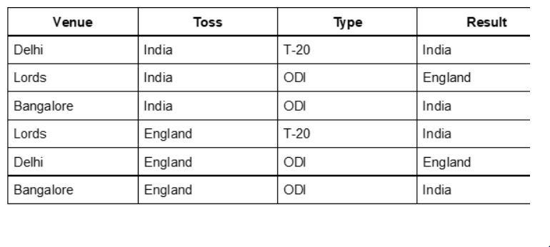

# Test3

## MCQS
#### 1.In a practical scenario, for which of the following cases Naive Bayes Algorithm performs well?  
A.Discrete variables
B.Continuous variables
- **A**
- B
- Both A and B
- None of them

#### 2.Which of the following is correct?
A. Bagging may reduce overfitting while Boosting can increase overfitting 
B. Boosting may reduce overfitting while Bagging can increase overfitting 
- **A**
- B
- Both A and B
- None of these

#### 3.Which of the following is true?
A. In bagging, we assign different weights based on the performance of the individual model while in boosting we assign equal weights to different models.
B. In boosting, we assign different weights based on the performance of the individual model while in bagging we assign equal weights to different models.
- A
- **B**
- Both A and B
- None of these

#### 4.With reference to scikit learn implementation of Random Forests, which of the following are hyperparameters? Select all that apply 
- **max_depth**
- **n_estimators**
- **n_jobs**
- Feature_importances_

#### 5.Consider the data given below:

This data is about the past 6 matches played between India and England.
You are asked to predict “Result” by building a decision tree using the Gini index. Which attribute will you choose as the root node?
- Venue
- Toss
- **Type**
- Result

#### 6.Which of the following are the hyperparameters of AdaBoost?
- classes_ 
- **learning_rate** 
- **n_estimators**
- Feature_importances_ 

#### 7.How can we reduce overfitting? Select all that apply 
- **Ensemble models**
- **Reduce Dimensions**
- Give more training data 
- **Regularization**
- Perform Univariate and multivariate analysis 

