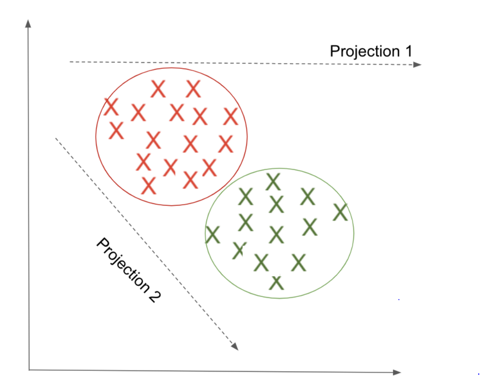

# Test4

## MCQS

#### 1.Given a list with elements [ 1, 2, 3 ], Calculate and select the correct option:

A. Standardization 
a.[ -1.225 , 0 ,  1.225 ] 
b.[  0,  1.225 ,  -1.225 ] 
c.[  0, -1.225  ,  1.225 ] 
d.[ 1.225 , 0 , -1.225 ] 

B. Normalization 
a.[ 0.5 , 0, 1 ] 
b.[ 0 , 0.5 , 1 ] 
c.[ 0.5 , 1, 0 ] 
d.[ 1 , 0.5 , 0 ] 

- A.c, B.a
- **A.a, B.b**
- A.b, B.c
- A.d, B.d

#### 2.Principal Component Analysis is an algorithm used to reduce ‘n’ dimensional data to ‘k’ dimensions where k<=n. What are the necessary steps to determine the value of ‘k’ in PCA? 
- Choose the minimum possible value for k irrespective of the explained variance ratio
- Elbow method
- **Choose ‘k’  eigenvectors with the larger eigenvalues**
- **Eigenvectors having eigenvalues close to 0 should be eliminated in new feature space**
- Eigenvectors having eigenvalues close to 0 should be considered in new feature space

#### 3.Which of the two projection is the more appropriate?

- Projection 1
- **Projection 2**
- Both A and B
- None of them

#### 4.ABC is a multinational company which sells different articles at different discount rates. Following is a snapshot of time-series data for different articles, we have an everyday number of units sold at a specific discount rate 

Which Time-series is suitable for this problem?
- Multivariate Time-series
- Multiple Time Series
- **Both Multivariate and Multiple Time Series**
- None of the above 

#### 5. Which of the following statements are correct?

Statement 1: ARIMA is appropriate only for a stationary time series.

Statement 2: ARIMA model has a short small forecast range.

Statement 3: ARIMA model is sensitive to outliers.

- Only Statement 1 is correct
- Only Statement 2 is correct
- Both Statements 1 and 3 are correct
- **All Statements 1, 2 and 3 are correct**

#### 6.You are making an application to help an oil trader to determine the price sentiment of oil, whether the price will go up (positive)  or go down (negative ) or it stays the same (neutral). You are scraping a large volume of news articles from different sources and want to perform the following steps :

1.Group articles as relevant and irrelevant with respect to oil price news

2.Every day from the relevant articles you need to find N events 

3.From aggregated events, you find the oil price sentiment

Which clustering algorithm makes the most sense for the above Step 1?
- **K-means**
- Agglomerative 
- C- Means
- Divisive

#### 7.You are making an application to help an oil trader to determine the price sentiment of oil, whether the price will go up (positive)  or go down (negative ) or it stays the same (neutral). You are scraping a large volume of news articles from different sources and want to perform the following steps :

1.Group articles as relevant and irrelevant with respect to oil price news

2.Every day from the relevant articles you need to find N events 

3.From aggregated events, you find the oil price sentiment 

In Step 2, every day there can be N different events and N will vary for each day. Suppose we decide to apply K-means to find N events, then in order to determine N we use Elbow Method, what all performance metrics can be used in elbow method Select all that apply

- Sum of Squared Errors
- Silhouette Score
- **Both 1 and 2**
- None of them

#### 8.The increase in the ratio of sales of tyres when the car is sold is 5, provided that the percentage of transactions of a tyre is 10, what is the percentage that tyre is bought when a car is bought :
- 0.5
- **50.0**
- 0.2
- 20.0
